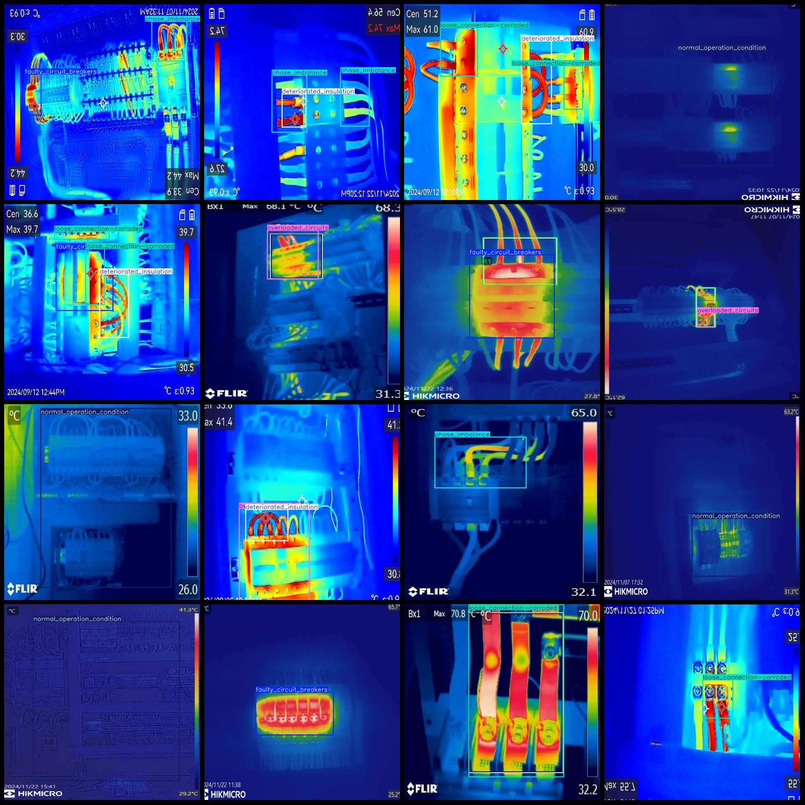
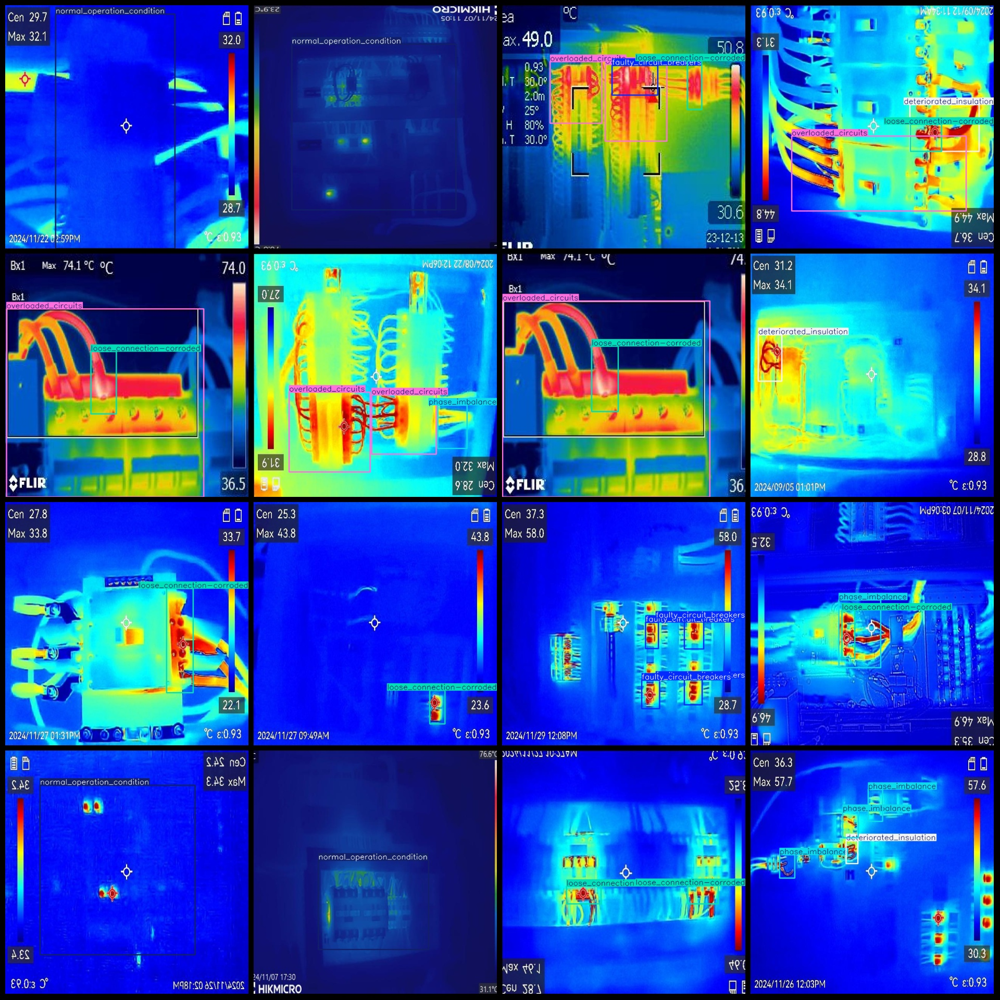

# Infrared Thermal Imaging Image Fault Detection Dataset for Electric Power Equipment - VOC+YOLO Format, 1729 Images in 6 Classes

Note: Of the dataset images, one third is the original and the rest are enhanced.

Dataset format: Pascal VOC format + YOLO format (txt file without segmentation path, only containing jpg images and corresponding VOC format xml files and yolo format txt files).

Number of images (jpg file count): 1729
Number of annotations (xml file count): 1729
Number of annotations (txt file count): 1729
Number of annotation categories: 6
Annotation category names (note that the order of categories in the yolo format does not correspond to this, but rather according to the labels folder's classes.txt): ["deteriorated_insulation", "faulty_circuit_breakers", "loose_connection-corroded", "normal_operation_condition", "overloaded_circuits", "phase_imbalance"]
Number of boxes per category:  
Deteriorated_insulation (insulation degradation) = 216  
Faulty_circuit_breakers (faulty circuit breakers) = 371  
Loose_connection-corroded (corroded loose connections) = 616  
Normal_operation_condition (normal operation condition) = 666  
Overloaded_circuits (circuit overload) = 528  
Phase_imbalance (phase imbalance) = 219  
Total boxes: 2616  
Image resolution: 640x640  
Annotation tool used: labelImg  
Annotation rules: draw boxes for each category  
Important note: The dataset does not have splits for training, validation, or testing; you need to do that yourself.
Special declaration: This dataset does not guarantee any accuracy of the trained models or weight files.
Image preview:

## Image

Here is a pay link on Stripe ( https://buy.stripe.com/3cs8yP7sY87d0vu9AB ). Please contact me lonlonago@foxmail.com after funding $89, and I will send you a complete data files , thank you!

